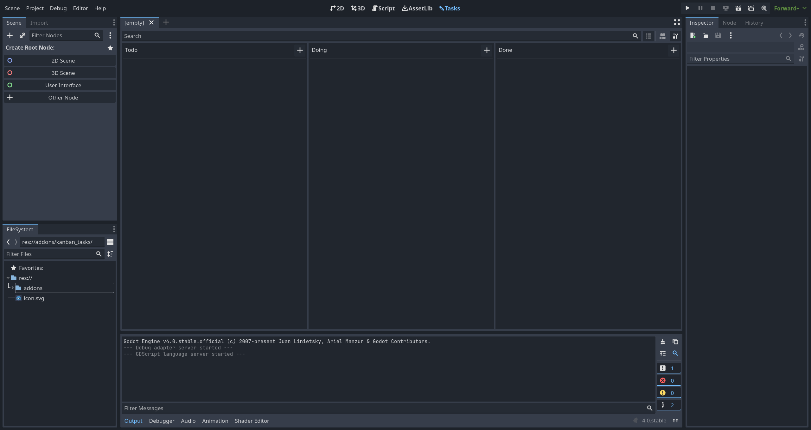
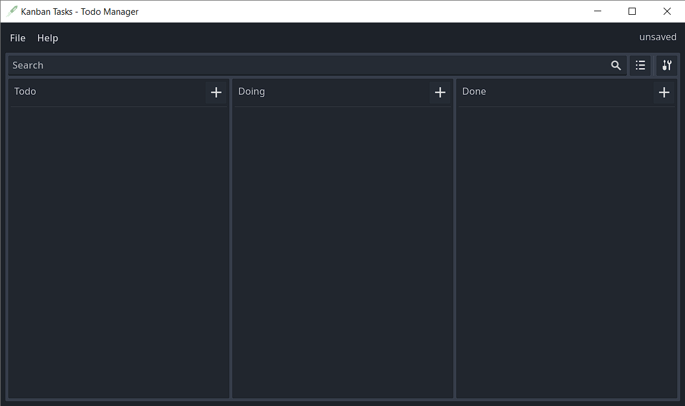
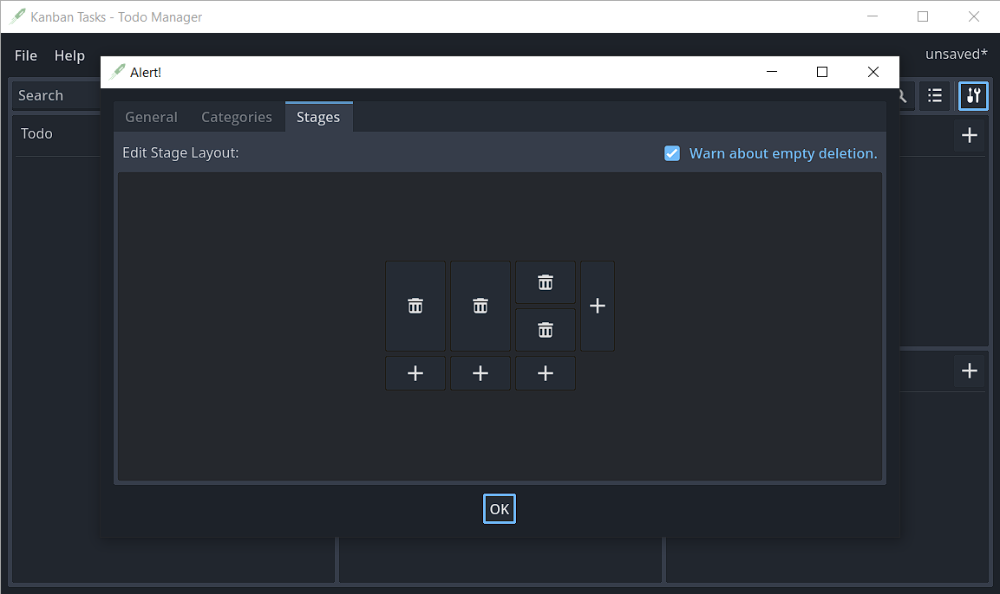
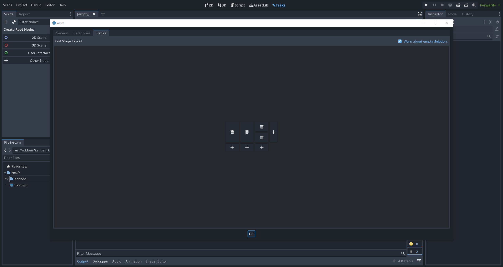
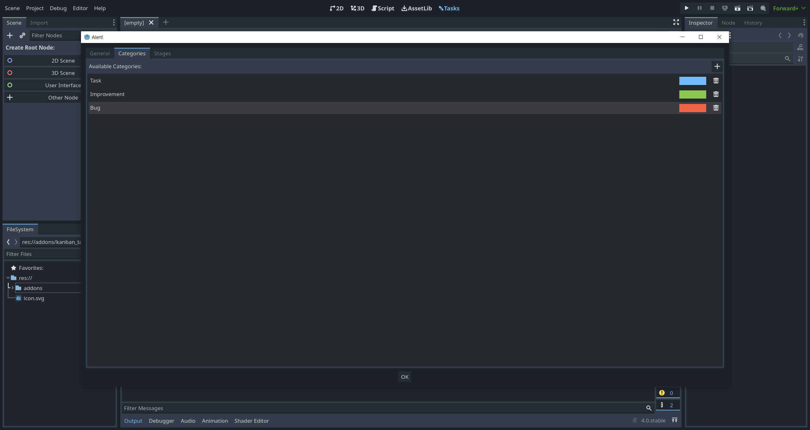
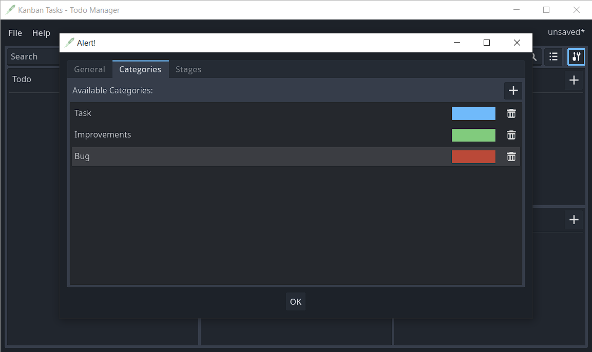
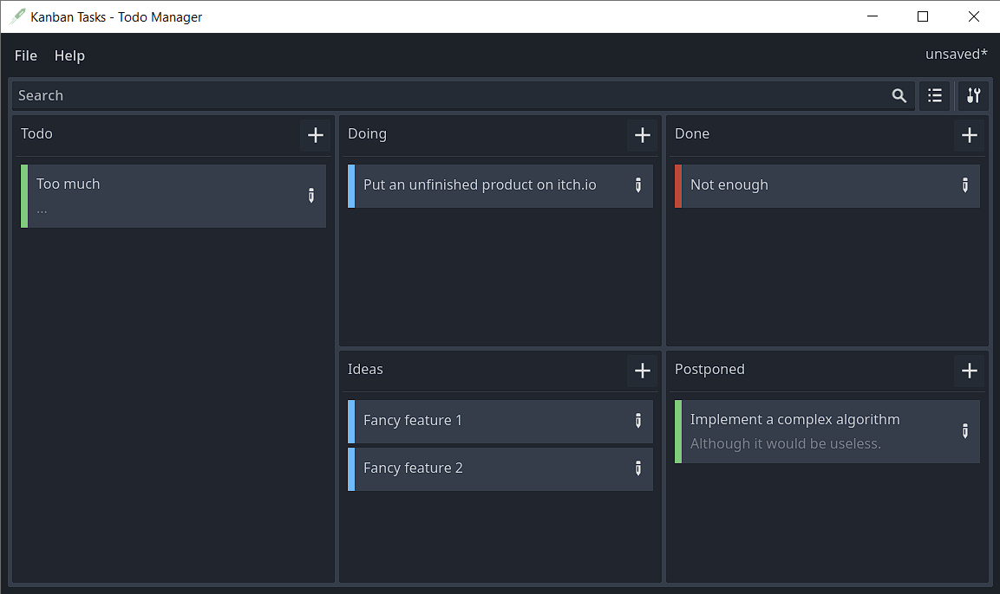
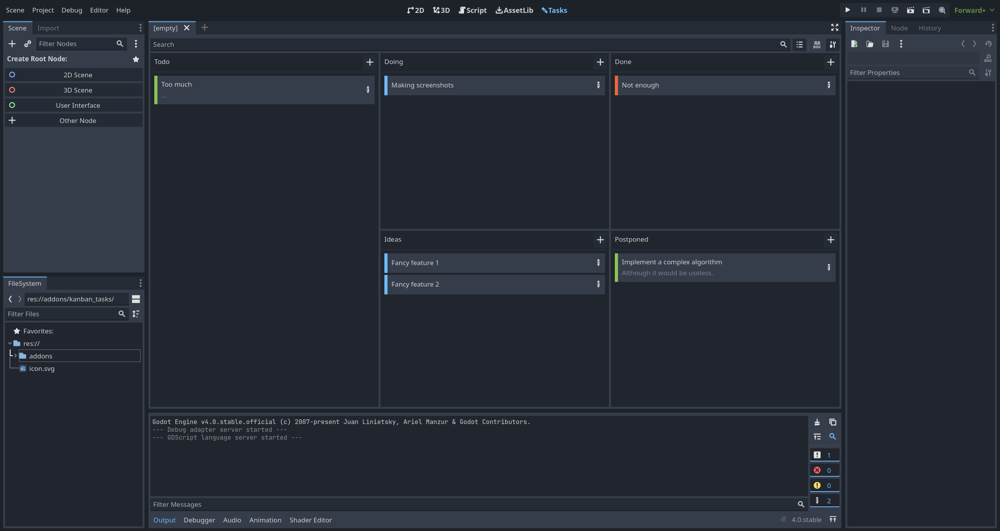

# :pencil2: Kanban Tasks - Todo Manager

Kanban Tasks - Todo Manager is a minimalistic kanban board application aimed at solo developers. It is available as addon for the [Godot Engine](https://godotengine.org) or as standalone application.

---

## :seedling: Setup
The editor plugin can be installed from the godot asset lib. After doing so add the plugin folder `res://addons/kanban_tasks` to your build exceptions to prevent it from getting bundled with your game.

---
## :rocket: Features
- Tasks with detailed description and title
- Intuitive drag and drop usage
- Customizable stage layout
- Shortcuts for common actions
- Categories to organize your tasks
- Integrates well with all Godot editor themes including light ones

---
## :question: Q & A

### :anger: Now that there is a standalone version will the editor plugin be discontinued?
No. Both versions are using the same codebase therefore new features and changes are only implemented once.
### :floppy_disk: Were is the data stored?
When using the editor plugin your board data can be found under `res://kanban_tasks_data.kanban`. You may want to backup it from time to time. Settings that are not related to a specific board are stored in the editor settings.
### :speech_balloon: Why this long name?
I wanted the plugin to be findable with the keywords `kanban`, `todo` and `tasks`. So this is what I came up with.
### :camera: Can I get some screenshots please?
|     |     |
|:---:|:---:|
|  |  |
|  |  |
|  |  |
|  |  |
